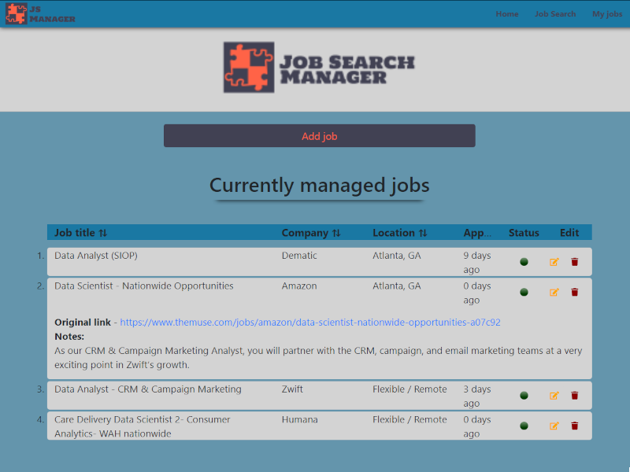

# Job Search Manager

- Check live website here => https://jobsearchmanager.netlify.app/

## What it is

- Job Search Manager is a solo project where I built an app that allows the user to pull available jobs from an API and automaticaly store the data in the job applications management tool or manually enter jobs that they applied for.

- The main purpose of the project was a practical approach in learning React, JSX and using the Redux state management library.
- The data from the My Jobs section is stored in the browser's local storage and loaded into the application's global state when the page refreshes or loads.



- Using real-time data from MapBox API and themuse.com/developers/api/v2, users receive a list of available jobs from which they can automatically populate the saved jobs form.

# Technologies and tools used:

- React
- Redux
- JSX
- JavaScript
- CSS
- React-Bootstrap
- REST API/AJAX
- Styled-Components
- The project is deployed on Netlify, via GitHub

### Some interesting code and facts:

- The project is divided into 2 main parts - the Search Jobs section and the Saved Jobs Manager board.

- In manipulating the response from the API I needed to use different techniques and JavaScript, including Regex and a React HTML-parser because the main content of the job search API has HTML tags embeded.

- For learning purposes I used a combination of class components and functional components in building the project:

Class based component:

```JSX
class ShowDetailedJob extends Component {
    render() {
        return (
            <>
                <div >
                    <h3 className="pt-4 h3Details" >{this.props.detailedJob.name}</h3>
                    <div className="mt-3 w-100 d-flex justify-content-between flex-row"><h4>@{this.props.detailedJob.company.name} </h4><h4>level: {this.props.detailedJob.levels.map((el) => {
                        return el.short_name
                    }).join('/')}</h4> </div>

                    <div className="mb-2 w-100 d-flex justify-content-between flex-row"><h5>{this.props.detailedJob.locations.map((el) => {
                        return el.name
                    }).join('/')}</h5> <h5 className="h6Date"> {this.props.detailedJob.publication_date.slice(0, 10)}</h5></div>
                    <div className="my-4 w-100 d-flex justify-content-center align-items-center">


            </>
        )
    }
}
```

```javascript
// map global state to a prop
// counter is our props: this.state.props
const mapStateToProps = (state) => {
  return {
    detailedJob: state.detailedJob,
  };
};
// update functions for state
// increment is a prop: this.props.increment(n)
const mapDispatchToProps = (dispatch) => {
  return {
    setDetailedToTemp: (n) => dispatch(tempJobForm(n)), // callback accepts param and passes it to dispatch
    toggleForm: () => dispatch(startAddJobForm()),
  };
};

// connect
export default connect(mapStateToProps, mapDispatchToProps)(ShowDetailedJob);
```

Functional component:

```JSX
const ShowAllJobs = ({ jobsInState }) => {
    // receive dispatch functions
    const dispatch = useDispatch()
    return (
        <>
            {jobsInState.map((job) => {
                return (<li key={job.id} className="pt-3 px-2 jobsLi" >
                    <h5 id={job.id} className="h5Li" onClick={(e) => {
                        dispatch(detailedJob(e.target.id));
                    }}>{job.name}</h5>

                    <div className=" w-100 d-flex justify-content-between flex-row"><h6>@{job.company.name} </h6><h6>level: {job.levels.map((el) => {
                        return el.short_name
                    }).join('/')}</h6> </div>

                    <div className="mb-2 w-100 d-flex justify-content-between flex-row"><h6>{job.locations.map((el) => {
                        return el.name
                    }).join('/')}</h6> <h6 className="h6Date"> {job.publication_date.slice(0, 10)}</h6></div>
                    <p> {job.contents.replace(/<[^>]*>?/gm, '').slice(0, 100)}...</p>
                </li>)
            }
            )}

        </>
    )
}
export default ShowAllJobs
```

- The user is able to save , edit and delete Saved Jobs entries and have them persist after session ends, through localStorage.

```JSX
 return (
        <>
            {showAddForm
                ?
                (<div className="row px-0 mx-0 mt-4">
                    <div className="col-8 offset-2">
                        <JobForm />
                    </div>
                </div>)
                :
                (<div className="row px-0 mx-0 mt-4">
                    <div className="col-6 offset-3">
                        <Button style={{ backgroundColor: "#414153", color: "#ff6347", border: "none" }} size="lg" block onClick={() => {
                            dispatch(startAddJobForm())
                        }
                        }>Add job</Button>
                    </div>
                </div>)}
            {/* end show button/form ternary */}
        </>
    )
```

- Saved Jobs list items + conditional rendering of details on click

```JSX
<JobLi key={job.id} onClick={() => {
                    dispatch(showDetails(job.id))
                }
                }>
                    <div className="row mx-0">
                        <div className="col-5 ">{job.jobTitle}</div>
                        <div className="col-2">{job.company}</div>
                        <div className="col-2">{job.location}</div>
                        <div className="col-1">{Math.round(Math.abs((jobDate - currentDate) / oneDay))} days ago</div>
                        <div className="col-1 d-flex align-items-center justify-content-center"></div>
                        <div className="showBtn col-1 d-flex align-items-center justify-content-end">

                            <Button className="deleteEdit" onClick={() => {
                                dispatch(setJobToEdit(job.id));
                                setModalShow(true);
                            }}>
                                <FontAwesomeIcon icon={["fas", "edit"]} color="orange" />
                            </Button>
                            <Button className="deleteEdit" onClick={() => {
                                dispatch(deleteSavedJob(job.id))
                            }
                            }>
                                <FontAwesomeIcon icon={["fas", "trash"]} color="darkred" />
                            </Button>
                        </div>
                    </div>
                    {job.showDetails ?
                        <div className="row mx-0">
                            <div className="col">
                                <div className="mt-3"><b>Original link </b> - <a href={job.link} target="_blank">{job.link}</a>
                                </div>
                                <div><b>Notes: </b>  <p>{job.notes}</p>
                                </div>
                            </div>
                        </div>
                        :
                        ""}
                </JobLi>)
```
